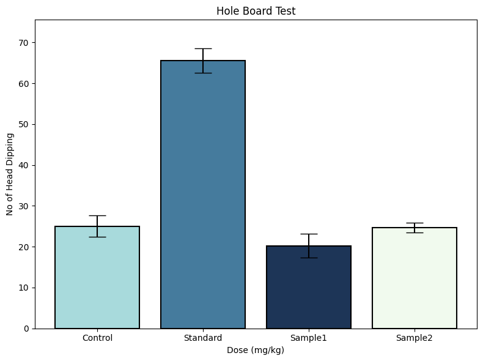
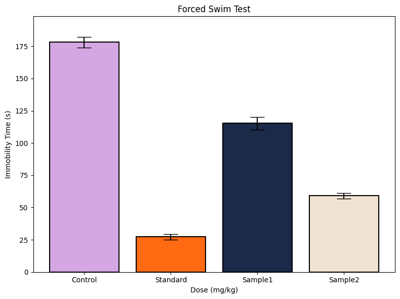
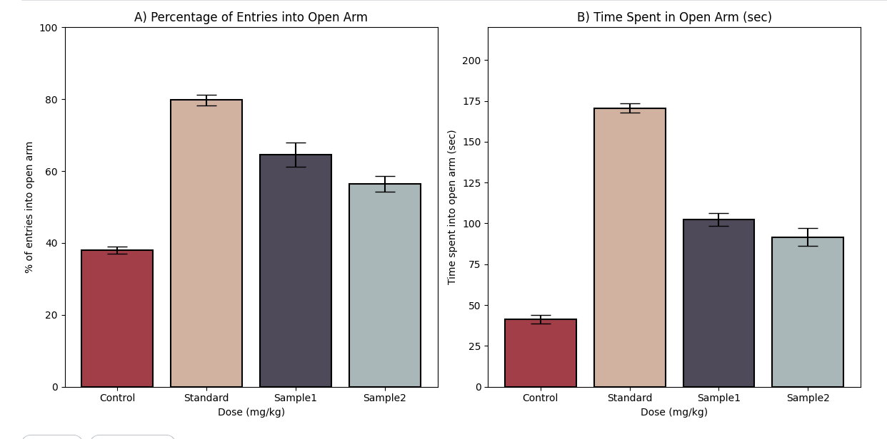

# NeuroBehavioral Insights: Data Analysis of Behavioral Tests

## 🧠 Background & Motivation

Mental health disorders, particularly **anxiety** and **depression**, are widespread global challenges. Yet, despite their prevalence, understanding the neurobiological mechanisms driving these conditions remains a significant challenge. **Behavioral animal models** play a crucial role in preclinical research, enabling scientists to study **neurobehavioral responses** and evaluate the effects of potential therapeutic treatments.

This project focuses on analyzing **behavioral neuroscience data** from multiple well-established tests used to model anxiety and depression in animal models. These tests—**Hole Board Test**, **Forced Swim Test (FST)**, and **Elevated Plus Maze (EPM)**—are critical in studying the effects of drugs, behavioral changes, and other interventions.

The primary motivation for this analysis is to transform experimental data into **meaningful visual insights**, which can aid in **drug discovery** and **neuroscientific research**.

---

## 🧬 Key Tests Conducted

### 1. **Hole Board Test**
- **Purpose**: Measures exploratory behavior, which is often inversely related to anxiety. 
- **Metric**: Number of head dips into holes on a board.
- **Insight**: The `Standard` group showed the highest head dipping, indicating lower anxiety and higher exploratory behavior. The `Sample1` and `Control` groups showed lower activity, suggesting anxiety-like responses.

### 2. **Forced Swim Test (FST)**
- **Purpose**: Evaluates depressive-like behavior by measuring how long animals remain immobile during forced swimming.
- **Metric**: Time spent immobile in water.
- **Insight**: The `Control` group showed the longest immobility, indicative of depressive-like behavior. Conversely, the `Standard` and `Sample2` groups showed significantly reduced immobility, indicating potential antidepressant effects.

### 3. **Elevated Plus Maze (EPM)**
- **Purpose**: Assesses anxiety by analyzing how much time an animal spends exploring open vs. closed arms.
- **Metrics**:
  - Percentage of entries into the open arms.
  - Time spent in the open arms.
- **Insight**: The `Standard` group spent the most time in the open arms, suggesting anxiolytic effects. The `Control` group showed less exploration, indicating anxiety-like behavior.

---

## 📈 Why This Analysis Is Valuable

- ✅ **Preclinical Drug Screening**: The project helps evaluate the potential effects of **pharmacological agents** on anxiety and depression in animal models.
- ✅ **Neuroscience Research**: Provides insights into the **neurobiological** underpinnings of anxiety and depressive behaviors.
- ✅ **Data-Driven Insights**: Translates raw experimental data into **clear visualizations**, making complex results easily interpretable.
- ✅ **Scientific Storytelling**: Helps present complex behavioral data in a **storytelling format**, making it accessible for wider audiences.

---

## 📂 Project Structure

- `data/`: Contains raw experimental datasets in `.xlsx` format.
- `notebooks/`: Python scripts used for generating data visualizations.
- `visualizations/`: Folder containing generated visualizations in `.png` format.
- `README.md`: The project documentation file (you are currently reading).

## 🛠 Technologies Used

- **Python 3**: The core programming language used for data analysis and visualization.
- **Pandas**: For data manipulation and analysis.
- **Matplotlib**: For generating bar charts and visualizations.
- **Excel**: To handle `.xlsx` files containing experimental data.

## 📊 Visualizations

The following metrics were visualized using **bar charts with error bars (SEM)**:

1. **Hole Board Test**: Shows exploratory behavior (anxiety-like traits).
2. **Forced Swim Test**: Analyzes immobility time to gauge depressive-like behavior.
3. **Elevated Plus Maze**: Assesses anxiety by comparing open-arm exploration.

Sample charts generated in this analysis:

## 📄 License

This project is licensed under the MIT License. Feel free to use, modify, or extend it with attribution.

## 👤 Author

**Tahjib Ahmed Siddique**  
Data Analyst & Research Enthusiast  
[LinkedIn Profile](https://www.linkedin.com/in/tahjib07) · [Email](mailto:tahjibahmedsiddique@gmail.com) · [Portfolio](https://tahjib07.github.io/)
